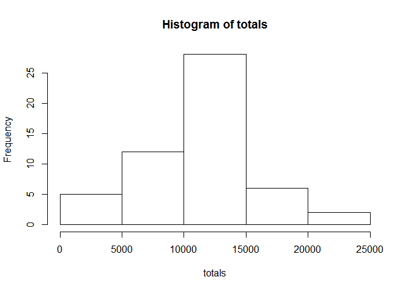
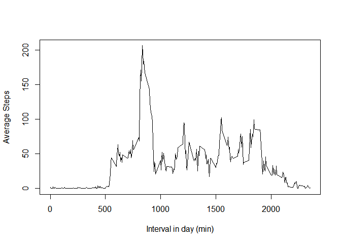
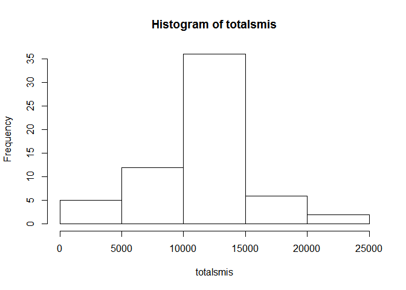
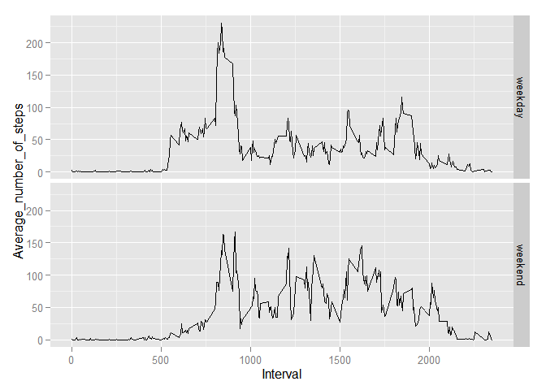

# Reproducible Research: Peer Assessment 1

##Loading and preprocessing the data:
The data is loaded and dates converted to corect format.

```r
data <- read.csv("activity.csv", stringsAsFactors = FALSE)
data[,2] <- as.Date(data[,2], "%Y-%m-%d")
head(data) # Just too check it out
```

```
##   steps       date interval
## 1    NA 2012-10-01        0
## 2    NA 2012-10-01        5
## 3    NA 2012-10-01       10
## 4    NA 2012-10-01       15
## 5    NA 2012-10-01       20
## 6    NA 2012-10-01       25
```

##What is mean total number of steps taken per day?


```r
totals <- sapply(split(data,data$date),function (x) sum(x[,"steps"])) #Calculate total number of steps
hist(totals) #Plot histogram
```

 

```r
mn <- mean(totals, na.rm = TRUE)
mn
```

```
## [1] 10766.19
```

```r
md <- median(totals, na.rm = TRUE)
md
```

```
## [1] 10765
```
The mean is 1.0766189\times 10^{4} and the median is 10765.

##What is the average daily activity pattern?

```r
average <- sapply(split(data,data$interval),function (x) mean(x[,"steps"], na.rm = TRUE))
plot(names(average),average, type="l",main = "",ylab = "Average Steps", xlab = "Interval in day (min)")
```

 

```r
maxsteps <- names(which.max(average))
maxsteps
```

```
## [1] "835"
```
The maximum number of steps happens at 835.

##Imputing missing values
Missing values are replaced with the average of the specific interval across all the days analysed, rounded to the nearest integer.

```r
numna <- sum(is.na(data[,1]))
datamis <- data
ismis <- is.na(datamis[,1])
datamis[is.na(datamis[,1]),1] <- round(average[as.character(datamis[ismis,3])])

totalsmis <- sapply(split(datamis,datamis$date),function (x) sum(x[,"steps"])) #Calculate total number of steps
hist(totalsmis) #Plot histogram
```

 

```r
mnmis <- mean(totalsmis, na.rm = TRUE)
mnmis
```

```
## [1] 10765.64
```

```r
mdmis <- median(totalsmis, na.rm = TRUE)
mdmis
```

```
## [1] 10762
```
The new mean is 1.0765639\times 10^{4} and the new median is 1.0762\times 10^{4}, compared with the old values of 1.0766189\times 10^{4} and 10765 respectively.

##Are there differences in activity patterns between weekdays and weekends?

```r
library(reshape2)
```

```
## Warning: package 'reshape2' was built under R version 3.1.3
```

```r
library(ggplot2)
```

```
## Warning: package 'ggplot2' was built under R version 3.1.3
```

```r
days <- weekdays(datamis$date)
days <- sub("Monday|Tuesday|Wednesday|Thursday|Friday","weekday",days)
days <- sub("Saturday|Sunday","weekend",days)
datamis <- cbind(datamis,as.factor(days))
plotdata <- melt(dcast(datamis,interval ~ as.factor(days),mean, value.var = "steps"), id = "interval")
names(plotdata) <- c("Interval", "Day", "Average_number_of_steps")
p <- qplot(Interval,Average_number_of_steps,data = plotdata,facets = Day ~ ., geom = "line")
print(p)
```

 
